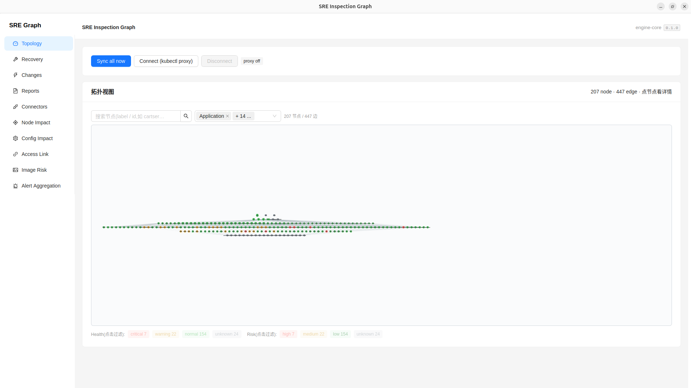
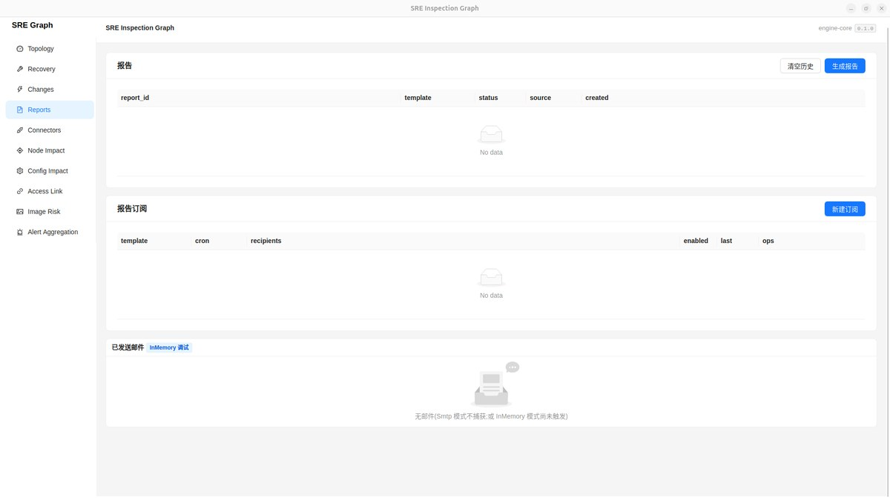
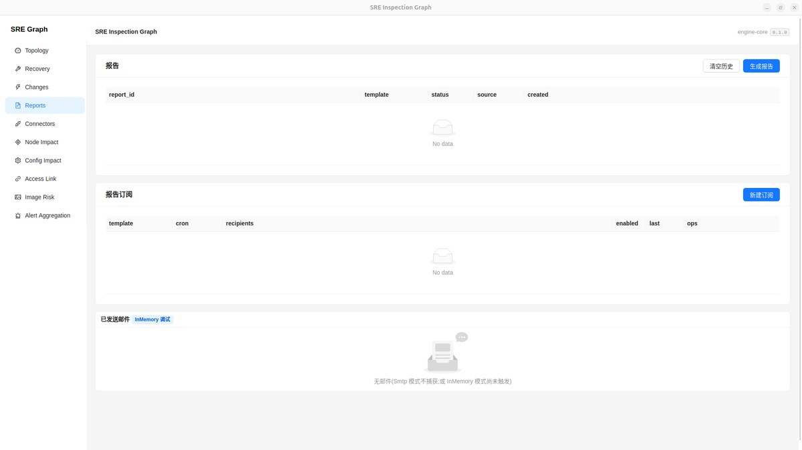
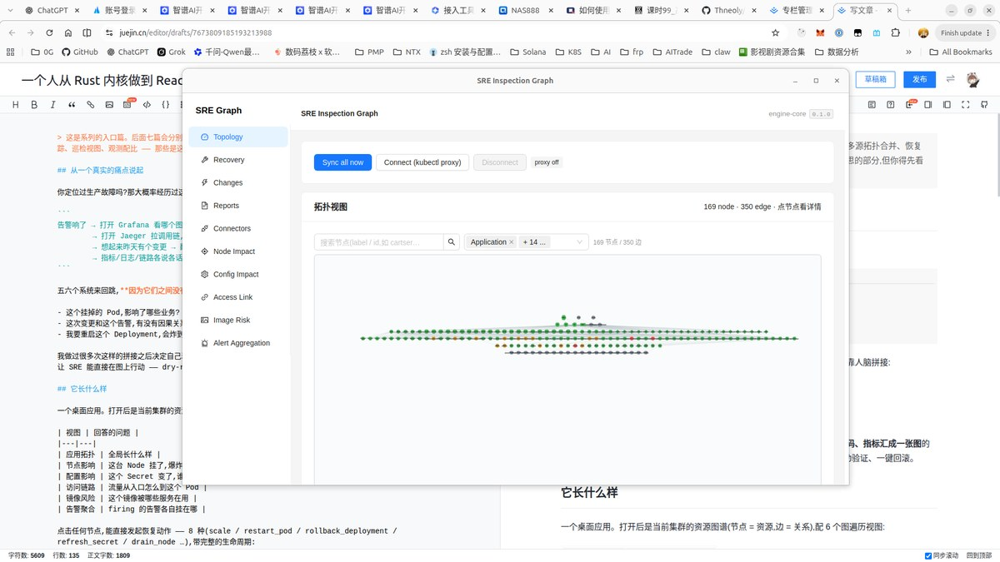
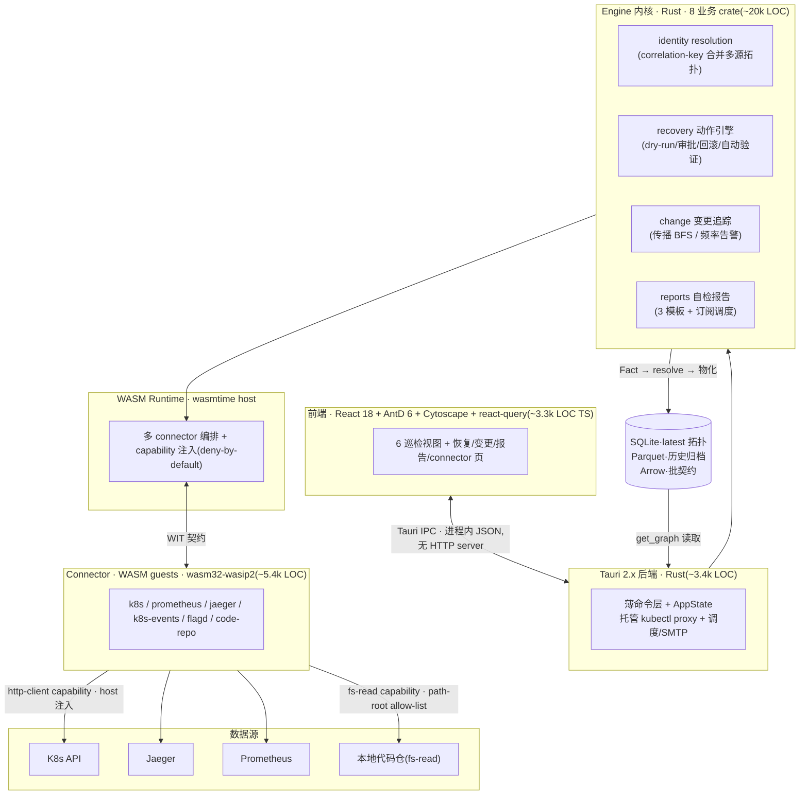

# SRE 巡检图谱平台 · SRE Inspection Graph

> 一个人**从 Rust 内核到 WebAssembly 沙箱、Tauri 桌面端、React UI 全栈设计与实现**的云原生「**感知 → 定位 → 恢复**」控制面:把分散的 K8s 拓扑、调用链、变更、代码、指标汇成一张资源图谱,让 SRE 在一个桌面端上完成故障定位与恢复编排。

**Rust · WebAssembly Component Model · Tauri 2.x · React 18 · SQLite/Parquet/Arrow**

---

## TL;DR

- **它是什么**:一个桌面端的 SRE 控制面。WASM 化的 connector 从 K8s/Prometheus/Jaeger/代码仓实时构建资源图谱(Identity Resolver 把多源拓扑合并成单一真相),上层提供 6 个图遍历巡检视图、变更追踪、恢复动作引擎(dry-run → 审批 → 回滚 → 自动验证)、自检报告。
- **它的卖点不是规模**:刻意按**桌面单机、数据不出本机**设计(对照 k9s / Lens)。价值在**架构深度与工程判断** —— 三层数据契约、不可信插件的 capability 沙箱、I/O-free 纯领域函数 + 行为级 contract test 的工程纪律。
- **现状**:v0.4.0,4 个 PRD(recovery / changes / reports / connectors)+ code-repo 源 + identity resolution 全部落地;在本地 kubeadm 集群的 OpenTelemetry Demo 上做了真数据验证。

> 想看完整的工程决策叙事(4 个 STAR 架构决策 + 量化 + 深入探讨 Q&A)?见 **[CASE_STUDY.md](CASE_STUDY.md)**。

## 界面一览(真集群数据,非 mock)



| 节点详情 → 恢复动作 | 节点影响(爆炸半径) | Connectors 状态 + 趋势 |
|---|---|---|
|  |  |  |

## 解决什么问题

真实 SRE 场景里,定位一次故障要在五六个割裂的系统之间来回跳:拓扑看 Grafana、调用链看 Jaeger、变更看 Argo/Git、指标看 Prometheus、恢复靠手敲 kubectl。**它们之间没有一张共享的资源图谱** —— 于是「这个挂掉的 Pod 影响了哪些业务」「这次变更和这个告警有没有关系」「恢复一个 Deployment 会炸到谁」全靠人脑拼接。

这个项目把这些问题收敛到**一张图 + 一套动作引擎**:同一个 canonical 资源身份贯穿拓扑、变更、调用、代码、恢复,任何一处的信号都能在图上找到对应位置并据此行动。

## 架构(一个人打穿的全栈纵切)



**关键边界**:UI ↔ Rust 走 Tauri 进程内 IPC(刻意不起 HTTP server);WASM connector 是**不可信插件**,只能通过 host 注入的 `http-client` / `fs-read` capability 访问外界,host 端 deny-by-default;所有下游只认 canonical `Fact`(7 字段)+ Arrow Schema。

## 核心能力

**巡检图谱(6 个图遍历视图)** —— 从起点 BFS、depth 限深、edge-type 白名单过滤的通用 `subgraph` 原语支撑:
应用拓扑 · 访问链路 · 节点影响(Node 故障爆炸半径)· 配置影响(Secret/ConfigMap 传播)· 镜像风险 · 告警聚合。

**恢复动作引擎(PRD-001 复刻)** —— 8 个动作(scale / restart_pod / rollback_deployment / refresh_secret / drain_node / kill_query / restart_service / clear_cache)。生命周期:`pending → dry_run_ok → awaiting_approval → executing → succeeded/failed → rolled_back`。一键回滚跳过二次审批;执行后自动验证,verify_failed 触发自动反向回滚;支持多步动作链 + 3 种失败策略。桌面单机确认门审批语义。

**变更追踪(PRD-002 复刻)** —— 4 类变更(configmap/secret/deployment/image),反向 BFS 算传播影响面,YAML diff(剔 10 个 K8s 噪声字段),过频变更自动升 severity,ChangeEvent ↔ AlertEvent 时间窗关联,k8s poll-diff 自动录入。

**Identity Resolver** —— 多源拓扑合并:同一资源被 K8s API 和代码仓用不同 ID 描述时(如 `image:{c}:{ns}:{ref}` vs `image-ref:<ref>`),经共享 correlation key 合并成单一节点,边端点自动 remap。`resolve()` 委托 `facts_to_graph` 前做 pre-rewrite 合并,零 schema 改(correlation_keys 走 attributes_json)。

**自检报告(PRD-003 复刻)** —— 3 个模板(application_health / cluster_overview / incident_report),Tera 渲染 Markdown,cron 订阅调度 + SMTP 发送 + .md 附件,SQLite 持久化跨重启。

**WASM connector 沙箱(PRD-004 + PRD-006)** —— 6 个数据源 connector,经 deny-by-default capability 访问数据源;首个非网络 capability `fs-read`(path-root allow-list,canonicalize 防目录穿越/符号链接逃逸)。

## 为什么这么设计(4 个架构决策)

> 这些是最值得深究的判断点,每个都是「有多个选项 → 选了一个 → 因为……」。

1. **canonical `Fact` 作为唯一数据契约,而不是让各模块直连数据源**。所有 connector 不管数据源(K8s API / Jaeger / Prometheus / 本地 fs),产出统一压平成 7 字段 canonical Fact;所有下游(storage / identity resolve / graph build / Arrow 批传输)只认它,一个 `engine-core::fact_schema()` Arrow Schema 把契约焊死。新增数据源只需写一个产出 Fact 的 WASM connector,内核零改 —— 这是整个平台可扩展的支点。

2. **Tauri 桌面优先,而不是 SaaS Web**。对照 k9s / Lens:**数据不出本机**,无租户/认证/多租户复杂度;UI ↔ 后端走进程内 IPC,不起 HTTP server(也由此砍掉 webhook 这类需要入站连接的能力,变更入口改为 poll-diff + 手动录入)。代价:多人协作/远程访问留后续。

3. **WebAssembly Component Model + deny-by-default capability**。connector 是「会跑用户指定代码 + 访问生产集群凭据」的不可信插件,必须沙箱化。host 用 wasmtime 加载 wasm32-wasip2 guest,`http-client` / `fs-read` 由 host 注入并按 allow-list 逐次放行;`fs-read` 第一天就强制 path-root 校验(canonicalize + `starts_with`,防 `../../etc/passwd` 与符号链接逃逸)。三层数据契约固化边界:WIT(WASM 边界)/ Tauri commands(UI 边界)/ Arrow+SQLite+Parquet(存储)。

4. **Identity Resolver 延后到「有真数据冲突」才落地**。Phase 6 本可以用合成数据演示拓扑合并,但合成冲突是假的 —— 会让整套仲裁逻辑对着不存在的问题空转。于是 deferred,直到 Phase 8 code-repo 给出真实冲突源(repo 的 `BUILDS` 边指向的镜像与 K8s 部署镜像用不同 ID)才落地 correlation-key 合并。**不为演示造合成问题** —— 这是这个项目里最显工程判断的一处。

## 技术栈与代码构成

| 层 | 技术 | 规模 |
|---|---|---|
| Engine 内核 | Rust,8 业务 crate(core / wasm / identity / recovery / changes / reports / storage / cli) | ~20k LOC |
| WASM connector | Rust guests,`wasm32-wasip2` + module-sdk | ~5.4k LOC,6 connector |
| Tauri 后端 | Rust,薄命令层 + AppState + 托管 kubectl proxy + 调度/SMTP | ~3.4k LOC |
| 前端 | React 18 + TypeScript + AntD 6 + Cytoscape + @tanstack/react-query | ~3.3k LOC |
| 测试 | Rust 单测 + e2e + 前端 vitest | **405 Rust** + 21 vitest |

**手写代码合计 ~32k LOC**(Rust ~29k + TS ~3.3k)。另有 `engine-bindings`(wasmtime bindgen 生成的 host 胶水,不计入手写)。

关键 Rust crate:`engine-core`(canonical Fact + Arrow Schema,所有下游只认它)· `engine-identity`(resolve/diff/topology_to_graph + correlation-key 合并 + health_merge)· `engine-recovery`(action_defs/cascade/execution/verifiers/chains)· `engine-changes`(ChangeEvent/propagation/yaml_diff/frequency/alert 关联)· `engine-reports`(3 模板 + 订阅调度)· `engine-wasm`(wasmtime host + capability 注入 + 多 connector 编排)· `engine-storage`(Storage trait + SQLite + Parquet)。

## 怎么跑

```bash
# 1. WASM connector(modules 是独立 workspace,target 隔离)
cd modules && cargo wasi-build          # 或:make modules-build

# 2. engine workspace(独立;Tauri 后端随下一步 tauri 命令一起构建)
cd ../engine && cargo build --workspace

# 3. 桌面端(在 desktop/ 下)
cd ../desktop && npm install
npm run tauri dev        # dev(GPU 合成层问题时:GDK_BACKEND=x11)
npm run tauri build      # 产物 → .AppImage / .deb / .rpm

# 验证 gate(仓库根 Makefile 聚合三个 workspace)
make test-all            # engine 测试 + 前端 vitest
make check-all           # engine + desktop + modules 的 clippy -D warnings
```

> 连真集群:本地 `kubectl proxy --port=8001`,manifest 里 connector 的 `api_base` 指向它。TLS/认证留在 proxy,WASM 只走明文 HTTP,不碰凭据、不加 capability。

## 真实数据验证(诚实说明)

在本地 VirtualBox + kubeadm 集群(3 节点)上部署 **OpenTelemetry Demo v1.11.0(Astronomy Shop,~20 个 polyglot 微服务)** 作为数据源验证:connector 真拉 K8s API / Jaeger / Prometheus,产出真实拓扑(**169 节点 / 350 边**)、真实调用链(CALLS 边)、真实变更事件(rollout 触发 poll-diff 自动录入)。

**这不是生产流量规模的故事** —— 项目刻意桌面单机、数据不出本机,规模不是卖点。otel-demo 是「真实 polyglot 微服务拓扑」的验证手段,用于证明 connector、identity resolution、recovery、巡检视图在真实形状的数据上跑得通,而不是合成 fixture 上的自欺。

## 项目状态

- **v0.4.0**(最新):4 个 PRD(recovery / changes / reports / connectors)+ code-repo 源 + C1 identity correlation-key 合并 = 完整 v2 story。
- **Deferred**:Unknown Dependency Queue(需指向有真实外部依赖的集群)、C1 v2(provenance/confidence/arbiter)、image_pushed 真 webhook(桌面架构冲突)。

## 文档导航

- **[`CASE_STUDY.md`](CASE_STUDY.md)** —— 完整工程叙事:4 个架构决策的 STAR 权衡 + 量化 + 深入探讨 Q&A(深读用)。
- `doc/blog/` —— 8 篇实践博客:全栈纵切 · WASM 沙箱 · 数据契约 · Identity Resolution · 恢复引擎 · 变更追踪 · 巡检视图 · 观测配比。
- `doc/15` + `doc/17` —— 数据契约规范(WIT / Tauri IPC / Arrow)· Tauri 桌面架构。
- `doc/11-13` —— Identity Resolver / Unknown Dep Queue 的 PRD + 端到端剧本。
- `doc/01-10` —— 原始需求 / 4 层图模型 / 6 视图 / 故障类型 / 数据源服务。

---

<details>
<summary><strong>English (short)</strong></summary>

A single-engineer, full-stack cloud-native SRE control plane: a Rust engine + WebAssembly-sandboxed connectors build a live resource graph from Kubernetes (fused with traces / changes / code), surfaced through a Tauri 2.x desktop UI for topology-aware diagnosis and recovery (dry-run → approve → rollback → auto-verify).

**Stack:** Rust (8 engine crates, wasmtime host, wasm32-wasip2 guests) · Tauri 2.x · React 18 + AntD 6 + Cytoscape · SQLite (latest topology) + Parquet (archive) + Arrow (batch contract). ~32k LOC hand-written (29k Rust + 3.3k TS), 405 Rust tests.

**Not a scale story** — deliberately desktop-first, data-stays-on-machine (cf. k9s/Lens). The value is architectural depth and engineering judgment: a 3-layer data contract (WIT / Tauri IPC / Arrow), a deny-by-default capability sandbox for untrusted connectors, and pure I/O-free domain functions with behavior-level contract tests. Validated against a real OpenTelemetry Demo deployment on a local kubeadm cluster (169 nodes / 350 edges).

See `doc/15` & `doc/17` for data contract & architecture, `CASE_STUDY.md` for the engineering narrative.

</details>

## License

MIT — 见 [LICENSE](LICENSE)。

